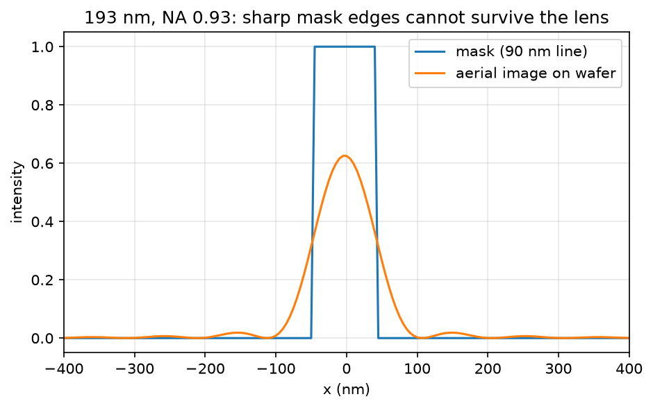
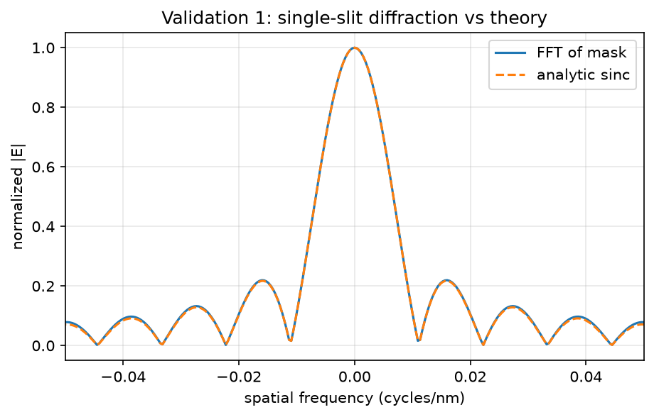
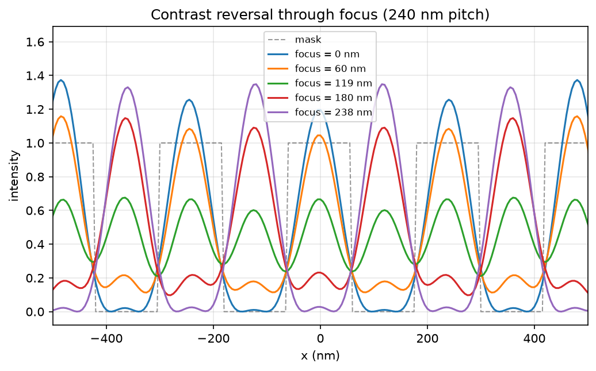
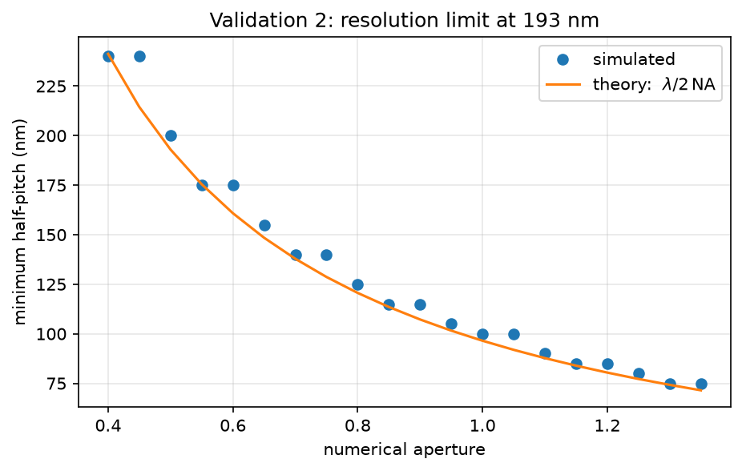
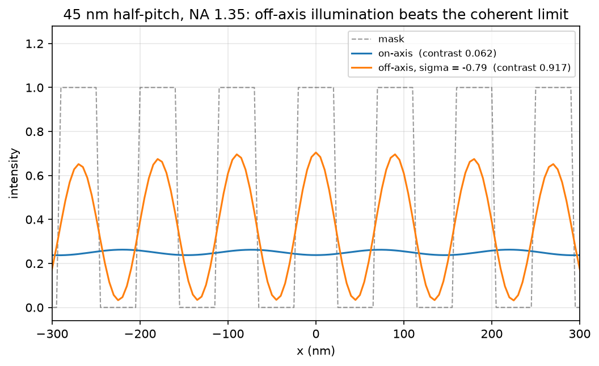
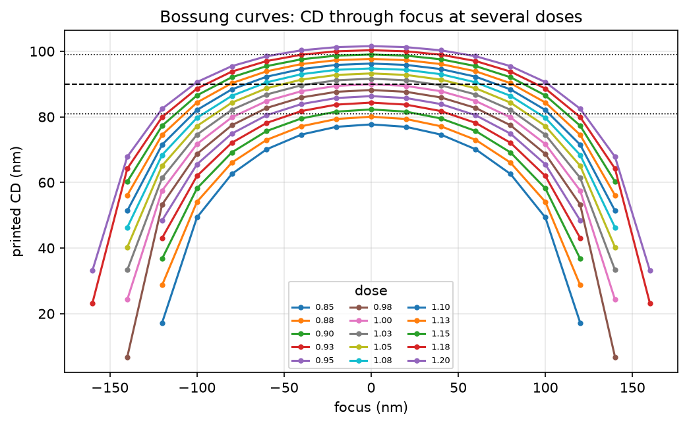
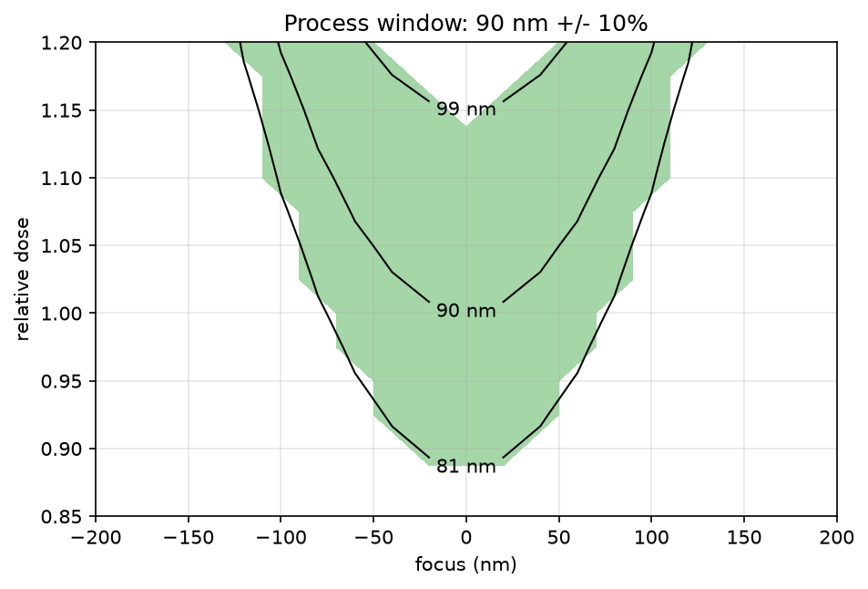

# Computational Lithography Simulator

A Python simulation of optical projection lithography.

I built this to get a better understanding of what actually limits semiconductor lithography as features get smaller. The simulator starts with a photomask, propagates the light through a simplified projection lens using Fourier optics, and calculates the aerial image that reaches the wafer.

From that image, it can measure things like:

* Critical dimension (CD)
* Image contrast
* NILS
* Depth of focus
* Focus/exposure process windows
* Resolution as a function of NA and wavelength

This isn't meant to be a model of a real ASML scanner. The goal was to build the optics from the ground up and see if the results match what the theory predicts.

The simulator was checked against three things:

* Single-slit sinc diffraction
* The $\lambda / 2NA$ resolution limit
* The Rayleigh depth of focus equation

For the depth of focus test, the simulation gave 200 nm compared with 223 nm from the Rayleigh estimate.

## How the simulation works

The idea is pretty simple:

mask -> FFT -> angular spectrum -> pupil / NA filter -> inverse FFT -> electric field ->|E|^2 -> aerial image

A photomask has openings that let light through. When the light passes through the openings, it diffracts. The projection lens can only collect light within a certain range of angles, which means some of the higher spatial frequencies are lost.

spatial frequency and diffraction angle are related by \(\sin\theta = \lambda f\) in the simulation

The numerical aperture sets the maximum angle the lens can collect:

\(NA = n\sin\theta_{max}\)

So the lens acts as a low-pass filter with a maximum spatial frequency of

\(f_{max} = \frac{NA}{\lambda}\)

Anything above that gets cut off.

Defocus is modeled by adding a phase shift to the pupil. Light traveling at different angles travels different distances when the wafer is moved away from the focus plane:

$$
\Phi(f) =
\frac{2\pi z}{\lambda}
\left(1-\sqrt{1-(\lambda f)^2}\right)
$$

I used the exact scalar expression here instead of the usual paraxial approximation:

\(\Phi \approx \pi\lambda zf^2\)

At high NA, the difference becomes pretty significant. At NA = 0.93, the paraxial approximation is off by almost a factor of two.

For the resist, I used a simple threshold model. If the intensity is above the threshold, that part of the resist is considered exposed. Changing the exposure dose effectively changes the intensity relative to that threshold.

### Assumptions

This version of the simulator assumes:

* Scalar diffraction
* Coherent, on-axis illumination
* An aberration-free lens
* Binary chrome-on-glass masks
* A simple threshold resist
* No resist diffusion or development kinetics

## Results

### Mask vs. aerial image



One of the first things I wanted to see was what happens to a sharp mask feature after going through the optical system.

A 90 nm rectangular feature doesn't stay rectangular. The aerial image becomes rounded, with a peak intensity of about 0.63 and some smaller side lobes.

This makes sense from the Fourier optics side. A perfectly sharp edge requires very high spatial frequencies, and the lens removes the frequencies above its NA cutoff.

The side lobes are also an example of the Gibbs phenomenon that shows up when a sharp feature is represented with a limited number of spatial frequencies.

---

### Validation 1: Single-slit diffraction



I first tested the Fourier transform portion of the simulator against the analytical result for a single slit:

\(w\,\mathrm{sinc}(wf)\)

This actually caught a bug in the code.

I was using an inclusive endpoint when creating the mask, so what was supposed to be a 90 nm slit was actually 95 nm wide. The error showed up as the side lobes slowly drifting away from the analytical solution.

Fixing the grid definition made the simulated diffraction pattern line up with the expected sinc function.

---

### What happens when the wafer is out of focus?



This shows a 240 nm pitch grating at several different focus positions.

Only three diffraction orders make it through the pupil in this example. That means the intensity can be written as

$$
I(x) =
0.453 +
0.637\cos\Phi\cos(kx) +
0.203\cos(2kx)
$$

At around 119 nm of defocus, the phase reaches $\pi/2$. The first-order term disappears and the pattern effectively prints at twice the intended pitch.

At 238 nm, the pattern comes back with full contrast but is inverted.

Neither of those behaviors was specifically programmed into the simulation. They come from the diffraction orders and the phase added by defocus.

---

### Validation 2: Resolution limit



I also measured the smallest resolvable half-pitch at different numerical apertures and compared the results with

$$
\frac{\lambda}{2NA}
$$

The simulated values stay on or above the theoretical resolution limit.

For the coherent, on-axis illumination used here, this corresponds to

\(k_1 = 0.5\)

The interesting part is that real lithography systems can get lower than this. Modern 193 nm immersion systems can use techniques like off-axis illumination and other optical tricks to push $k_1$ much lower.

That's one of the things I want to add to the simulator next.

---

### Breaking the coherent limit with off-axis illumination



The basic problem with on-axis illumination is that the 0th diffraction order is stuck in the middle of the pupil. The ±1 orders have to fit around it, which means a lot of the available pupil isn't being used as efficiently as it could be.

With off-axis illumination, the incoming light is tilted. This shifts all of the diffraction orders by

$$
f_{ill} = \frac{\sin\theta_{ill}}{\lambda}
$$

That lets the 0th and +1 orders move toward opposite edges of the pupil, giving roughly twice the usable frequency range.

The resulting resolution limit is

$$
\text{half-pitch} \geq \frac{\lambda}{4NA}
\qquad (k_1 = 0.25)
$$

The optimal illumination tilt in terms of the normalized pupil coordinate is

$$
\sigma = -\frac{\lambda}{2pNA}
$$

There's also an important constraint here: the illumination itself still has to fit through the lens. In other words, $|\sigma|$ can't be greater than 1.

When $|\sigma| = 1$, the required illumination angle is right at the edge of the lens's acceptance angle. That gives the resolution limit above.

So in this case, the resolution limit has a pretty intuitive meaning: **you've reached the point where the illumination angle needed to resolve the feature is too large for the lens to accept.**

### Simulation results

I tested this at 193 nm wavelength with NA = 1.35:

|          |  Theory |                           Fails at |               Works at |
| -------- | ------: | ---------------------------------: | ---------------------: |
| On-axis  | 71.5 nm |             70 nm (contrast 0.384) | 75 nm (contrast 1.000) |
| Off-axis | 35.7 nm | 35 nm ($\sigma=-1.02$, impossible) | 40 nm (contrast 0.891) |

The figure uses a 45 nm half-pitch mask as an example. On-axis, the image basically turns into a featureless gray pattern because the necessary diffraction orders can't all fit through the pupil.

With off-axis illumination and $\sigma=-0.79$, the same pattern reaches about 0.917 contrast.

The off-axis result doesn't quite reach the 1.0 contrast seen in the ideal on-axis case. That's because the two-beam interference has unequal amplitudes, so the intensity doesn't completely cancel at the dark points.

In other words, there is a small tradeoff: the contrast isn't quite as clean, but the theoretical resolution is almost twice as good.

This is essentially the idea behind dipole illumination. Techniques like this were an important part of getting 193 nm lithography down to much smaller feature sizes, including around 38 nm half-pitch.


### Bossung curves and process window





These plots show how the printed critical dimension changes with focus and exposure.

The curves are roughly symmetric around best focus in this simplified model. Real optical systems can become asymmetric because of things like lens aberrations.

The process-window plot shows the range of focus and exposure where the printed CD stays within ±10% of the 90 nm target.

---

### Validation 3: Depth of focus

The largest contiguous in-spec focus range from the simulation was:

**200 nm**

The Rayleigh estimate gives:

$$
DOF \approx \frac{\lambda}{NA^2} = 223\text{ nm}
$$

The simulation samples focus in 20 nm increments, so the measured value is limited by the grid resolution. Also, the $k_2$ factor used in depth-of-focus formulas depends on the convention being used.

Getting 200 nm vs. 223 nm is close enough to show that the model is behaving as expected.

---

## Things I found while building it

A few of the more interesting problems weren't actually with the optics themselves.

### Spectral leakage

The FFT assumes the simulation window repeats periodically. If the window doesn't contain an integer number of grating periods, the diffraction orders don't line up perfectly with the frequency bins.

That causes some energy to leak into neighboring bins.

This is one reason the resolution test uses a 0.99 contrast threshold instead of simply looking for 0.5. The leakage can produce contrast values up to about 0.976 even when the image isn't actually behaving like the ideal three-beam solution.

Pitches that fit an integer number of times into the simulation window, such as 80, 160, and 320 nm, don't have this problem.

### Duty-cycle quantization

If the pitch isn't an integer number of pixels, it's impossible to represent an exact 50% duty cycle on the grid.

That slightly changes the harmonic amplitudes and introduces another small source of error.

### Resolution curve scatter

The frequency bins are separated by

$$
\frac{1}{2560}\text{ cycles/nm}
$$

Since the half-pitch is related to the bin number by

$$
p = \frac{1280}{b}
$$

one bin of uncertainty gives approximately

$$
\Delta p \approx \frac{1280}{b^2}
$$

For example, this works out to roughly ±36 nm at NA 0.45 and ±4 nm at NA 1.35.

That explains most of the scatter in the resolution plot. A better way to handle it would be to change the simulation window for each pitch so that the grating always fits an integer number of times.

### Nyquist limit

The current grid uses 5 nm pixels, so the smallest representable period is 10 nm.

That means this grid isn't good enough for actually modeling EUV lithography at 13.5 nm. I'd need a finer grid for that.

---

## Current limitations

There are still a lot of things this model doesn't include:

* Partial coherence
* Off-axis illumination
* Lens aberrations
* Phase-shifting masks
* Vector electromagnetic effects at high NA
* Resist diffusion
* Resist development kinetics
* Photon shot noise / stochastic effects

These are also basically the roadmap for where I want to take the project.

---

## Repository layout

| File                | What it does                                                  |
| ------------------- | ------------------------------------------------------------- |
| `mask.py`           | Creates the simulation grid and mask patterns                 |
| `fourier.py`        | FFT propagation, frequency coordinates, and analytical checks |
| `optics.py`         | Pupil function, NA, wavelength, defocus, and aerial image     |
| `metrics.py`        | Resist thresholding, edge detection, CD, contrast, and NILS   |
| `resolution.py`     | Resolution sweeps across NA and wavelength                    |
| `process_window.py` | Focus/exposure matrix, Bossung curves, and process window     |
| `test_litho.py`     | Tests the optical model against analytical results            |
| `make_figures.py`   | Regenerates the figures used in this README                   |

---

## Running it

```bash
git clone https://github.com/<your-username>/litho-sim.git
cd litho-sim

python3 -m venv .venv
source .venv/bin/activate

pip install numpy scipy matplotlib pytest

pytest -v
python make_figures.py
python process_window.py
```

`pytest` runs the analytical checks, `make_figures.py` regenerates the plots, and `process_window.py` runs the focus/exposure simulation.

---

## What's next

The main things I'd like to add are:

**Partial coherence**

Replace the single coherent plane wave with an extended source and see how that changes the aerial image and process window.

**Phase-shifting masks**

Allow the mask to have complex transmission, including regions with a $\pi$ phase shift.

**Lens aberrations**

Add Zernike terms to the pupil and see how aberrations change the Bossung curves and process window.

**Stochastic effects**

Add photon shot noise and look at the resulting distribution of printed CDs instead of just calculating one deterministic CD.

Interactive dashboard

Eventually, I'd like to have sliders for things like wavelength, NA, pitch, focus, and exposure so the optical behavior can be explored without changing the code.

---

## Built with

Python • NumPy • SciPy • Matplotlib • pytest